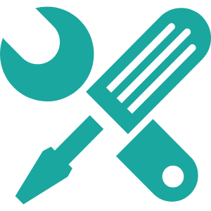

<p align="center">
  
</p>


# tools4js
[](https://img.shields.io/travis/swdenglian/tools4js)
[](https://npmjs.com/package/tools4js)

## How to use
#### install
```
npm install tools4js
or
yarn add tools4js
```
#### import and use
```
import { Timer } from 'tools4js';
new Timer().format('yyyy/MM/dd');
```

### How did development this repo

clone this repo
```cmd
  git clone https://github.com/swdenglian/tools4js.git
```
dev
```cmd
  npm install
  npm run dev  
```
test
```cmd
  npm run test
```

## Features
- Development of common problem tools library in JavaScript

## Support
- ES6/ES7/TypeScript

## LICENSE
MIT LICENSE